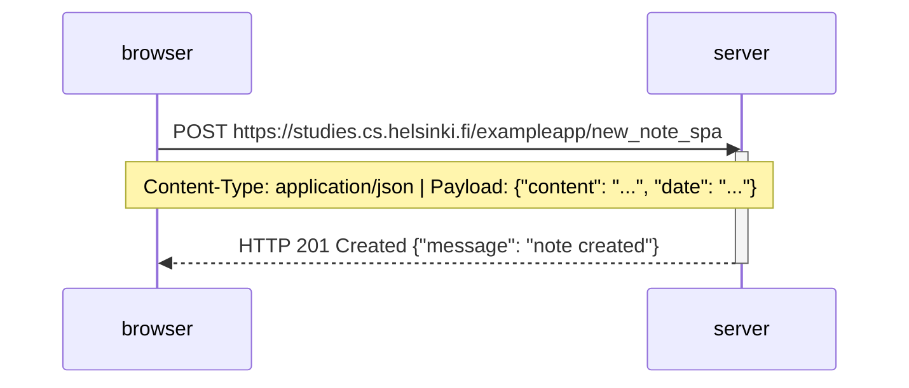

```mermaid

sequenceDiagram
    participant browser
    participant server

    browser->>server: POST https://studies.cs.helsinki.fi/exampleapp/new_note_spa
    activate server
    Note over browser,server: Content-Type: application/json | Payload: {"content": "...", "date": "..."}
    server-->>browser: HTTP 201 Created {"message": "note created"}
    deactivate server

```